Sublime Tips and Tricks
===

# Introduction

This webcast will outline tips and tricks coaches at Udacity believe Intro to Programming students can greatly benefit to increase their coding productivity and coding enjoyment.

# Choosing Programming Language

The first tip involves learning how to choose the right programming language to allow syntax highlighting and autocompletion.

We would click on the lower right corner of Sublime Text

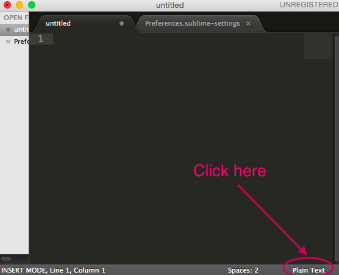

And we then choose our programming language we want to program in.

# Tabs vs Space Characters

Indentation is critical to create good readable code. It's important that programmers indent consistently and do not use both tab characters and space characters in their indentation. For example, if we were to turn on the feature to show hidden characters, we can see this code contains a combination of tab characters and space characters. The tab characters are denoted by hyphens and the space characters are denoted by the dots.

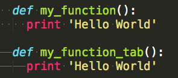

We recommend our students to choose either the tab character or space character to indent, but never both because this could lead to strange errors in the Python interpreter.

To tell Sublime Text to use space characters when we hit the "Tab" key, we go to "Spaces" in the lower right hand corner, and click on the option to "Indent Using Spaces" option.

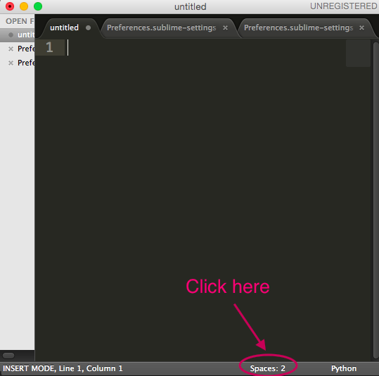

# Layout

Sometimes when we code, it would be beneficial to look at more than one source code at a time. Sublime offers the layout feature to show different files in a row and column-based layout.

For example, in order to show two different files in 2-column layout, we first go to `View -> Layout -> Columns: 2`

We open our two files and then drag one of the files to the other column:

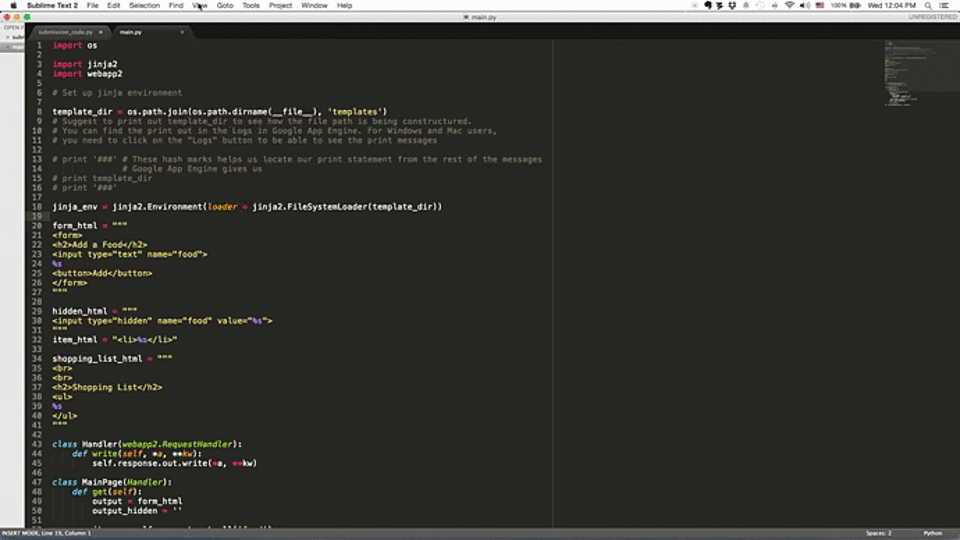

# Sidebar

If you're working on a big project with multiple files, you may want to always have access to your project directory. Sublime's side bar lets you do exactly this.

To show the side bar, simply go to `View -> Side Bar -> Hide Side Bar`. We can then go to `File -> Open` and navigate to our project directory. Then click on the directory name and hit `Open`. This shows all all files and folders inside the directory. To later hide the side bar, go to `View -> Side Bar -> Hide Side Bar`.

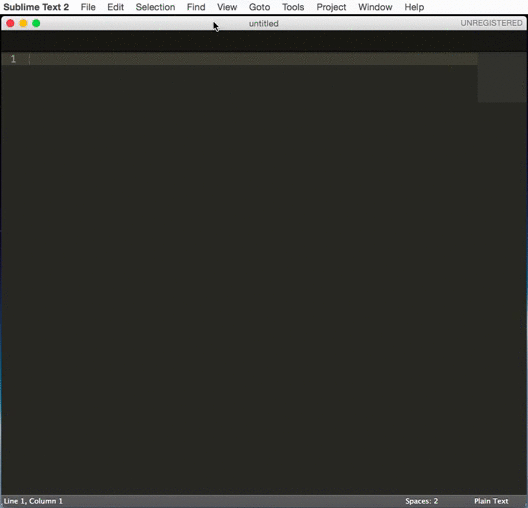

# Quick Find

Quick Find feature is a feature in Sublime Text that allows programmers to see the exact placement of words in the file.

Let's assume we want to look for all instances of the word 'in', we can click on a 'in' word and go to `Find -> Quick Find`

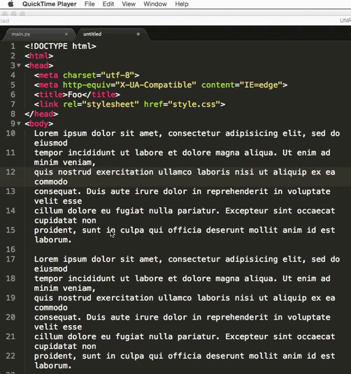

# Quick Find All

Similarly, we can use "Quick Find All" and Sublime will allow us to replace all instances of the word with another word.

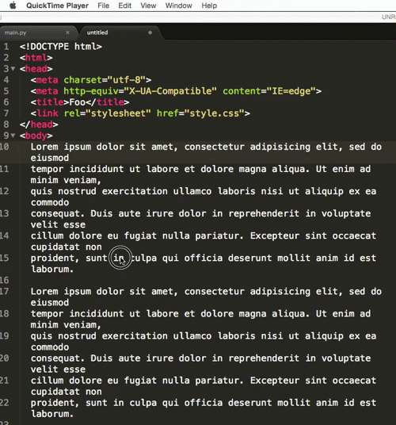

# Goto

When we are working on code that is long, it's useful for us to go to and reference functions that we've created. We can use the Goto menu. To go to a function that we've defined in our code before, we choose `Goto -> Symbol` and type in the function name to jump to our function definition.

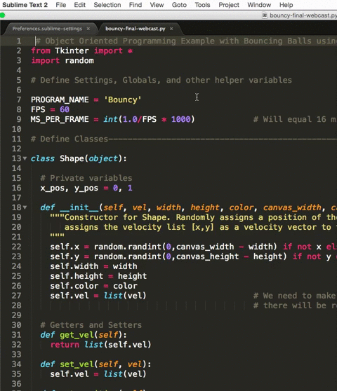

# Quick Commenting Code

Occasionally we want to comment out many lines of code and there is a quick keyboard shortcut to comment out many lines of code: `'Command' + '/'` on Macintosh or `'Ctrl' + '/'` on Windows and Linux systems:

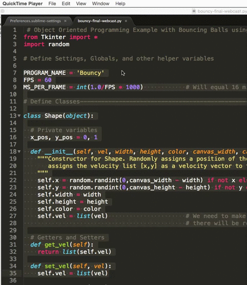

# Code Folding

When we want to focus on section of a code and want to ignore the rest of the code, we can use code folding by hovering our mouse over to the left hand side of the gutter and click on the triangle shape to fold and hide the code. We must indent properly in order for Sublime to how to fold our functions.

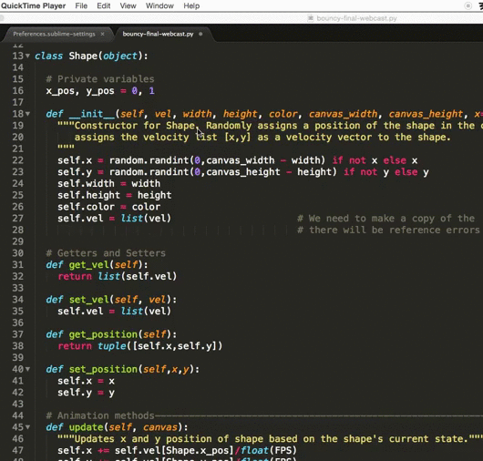

# Running Python Code

If our system is setup appropriately and Python is added to our PATH in your system, then Sublime will be able to directly run your Python command with the command `'Command' + 'B'` for Macintosh or `'Ctrl' + 'B'` for Windows and Linux systems.

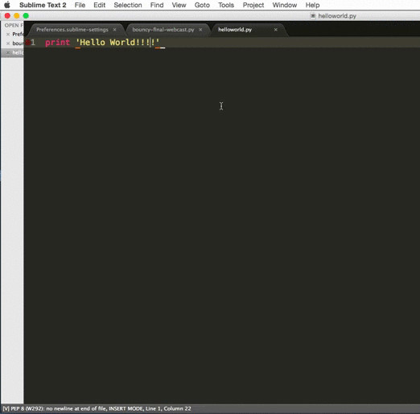

# Current Line Highlighting

This feature is useful and is often turned on by default for other text editors. For programmers handling multiple different files and interfaces, the option to highlight the current line of code the cursor is currently at is really important.

We need to configure the User Settings in Sublime and add in this line of code:

`"highlight_line": true`

To access this text file for Windows and Linux users, we go to:

`Preferences -> Settings - User`

For Macintosh, we go to:

`Sublime Text 2 or 3 -> Preferences -> Settings - User`

Therefore the entire settings file should look like this:

```
{
	"highlight_line": true,
}
```

Enter this line of code, save it, and Sublime Text will automatically highlight the line of code that the keyboard cursor is on.

# Automatic Extra Space Trimming

In the same Settings - User file, we can add in an additional command to trim extra space characters at the end of the line. This helps us maintain clean code and gets rid of superfluous characters in our source code files.

`"trim_trailing_white_space_on_save": true`

```
{
	"highlight_line": true,
	"trim_trailing_white_space_on_save": true
}
```

# Final Tips

If you're more interested in exploring more settings you can change for Sublime, we recommend you explore the file `Settings - Default` under Preferences to explore the many other options we can put inside our `Settings - User` file.

Two things you might want to check out would be the `Font Size` and `Color Scheme` options. You can find these under the `Preferences` menu you used to get to `Settings - User`. Here you can make the font size bigger or smaller, and change the colors Sublime uses with your code.


