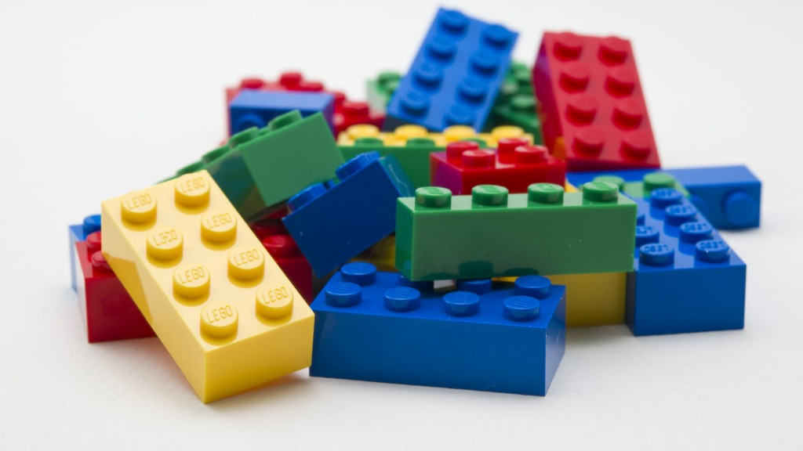
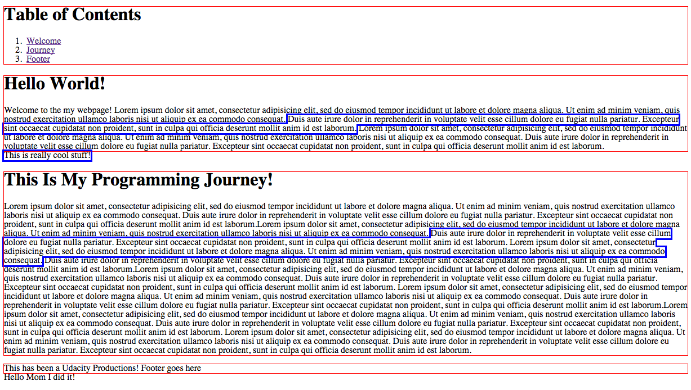

Divs, Spans, Ids, And Classes Oh My!
==========================================

Here is a link to the [Webcast][WB]

#What We Will Learn

  - Understand the difference between these tags and attributes
  - Learn when to use a `div` versus a `span`
  - Learn when to use an `id` attribute versus a `class`
  - Understand the bigger picture of an HTML document through the use of these tags and attributes

##HTML Document

Let's first understand that all elements in a website can be thought of as boxes or rectangles. Our job is to lay these rectangles together on a page, similar to stacking lego bricks together on a floor.

It's very important to understand this bigger concept before we explore the differences between `div` and `span`

Once we understand that we are simply laying rectangles together, we need to further realize that some rectangles take up the whole screen known as a whole `block` and some rectangles do not take up the entire screen known as `inline`.

##Divs

Let's explore what `div`s and `span`s look like in our `demo.html` document. As we can see we cannot really see the difference on a normal website unless we modify the style sheet or CSS. Here's a great tip for beginner web programmers: we use the `outline` attribute to put an outline over our elements to visually see how the rectangles are interacting with each other.

Once we uncommented out the style code, and refresh the browser we can clearly see the `div` outlines and the `span` outlines. Divs are in red and spans are in blue. First notice how the `div`s takes up the entire width of the screen and does not allow for any other text to share the same space that this block shares. Therefore `div`s are known as `block-level` elements because we can think of them as a whole block that prevents other elements to share the same space as this block element.

To illustrate this block level behavior, notice on line 99 in `demo.html`, we have the line "Hello Mom I did it!". Since this footer div is a block-level element, "Hello Mom I did it!" will get pushed to the next line. Let's change this footer from a `div` to a `span` element.

##Spans

If we change the footer to a `span` element, and refresh the browser, we see that the line "Hello Mom I did it!" is now on the same line as our element!

This illustrates how `span` is an `inline-level` element. The inline element will not push the rest of the elements next to it on another line. `Span` elements will not affect our layout unlike `divs`.

##Grouping

If we zoom out and look at the entire page we can clearly see divisions in the HTML where the "Welcome" `div` contains our welcome message and the "Journey" `div` contains information about our programming journey.

`Divs` are mainly used to group items together to:

1) Logically organize our code.

2) Group our items together so we can add styling to the whole block of code all at once. This avoids repetition because we don't have to single handedly assign the same styles to all of our elements inside our div block.

Since spans are inline-level elements, they are usually not used to group items together and are used to style parts of text or a few elements together without affecting the layout of the page.

##Ids and Classes

Let's now talk about attributes in an element. `id` and `class` can often be confused to what their purposes should be in HTML.

###Id

`Id`s are used to **uniquely** identify an element in the entire web page. That means `
` should be the **only** element with the unique identifier: "welcome". There should not be any other element with the name "welcome".

We should use `id` for special cases to give us the ability to uniquely identify elements and should be used sparingly because having a lot of id's in a website will slow our browser down.

Note that with ids, we can use an anchor element to link directly to our unique id with:

`<a href="#welcome">Welcome</a>`

We can see this code in the `demo.html` file towards the top of the file. Whenever a user clicks on that link, the website will jump directly to our unique element.

###Class

Classes are used to style a group of elements similarly. Let's use the analogy of a floorboard in a house. Each floorboard can represent an element and we want to assign all of these elements `class="floorboard"` where the floorboard styling rule will contain the color to be "brown" since floorboards are usually brown.

If we want to style a special floorboard, such as a floorboard that creaks, we can use another class called "creak" and add in that additional style such as:

`
`

or we can use an id to uniquely identify this floorboard such as:

`
`

It's recommended to use classes as much as possible in our HTML to style our elements because it's efficient for browsers to style elements belonging to the same class and it makes our code easier to understand and maintain.

##Summary

HTML is simply made up of a series of rectangles we put on a page. We use certain elements to layout our rectangles in either `block-level` or `inline-level` to control the flow of our pages.

`Div`s are block-level and `span`s are inline-level and are used differently. `Div`s are used more for grouping items together and creating a layout structure and `span`s are used to style text and individual elements.

`Id`s should be used sparingly and are used to uniquely identify an element. `Class` is recommended over `id` to style similar elements together.

[WB]: https://plus.google.com/events/cb4erijb0rfeen0c95mcutu1mfo?authkey=CM6vuqD859S5NQ
