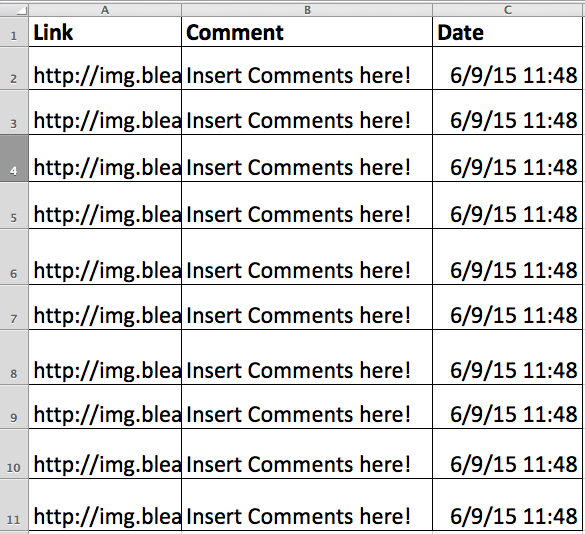
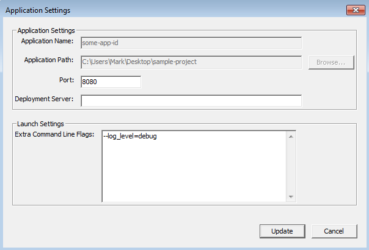

Google Datastore
==========================================

Here is a link to the [Webcast][WB]


## Big Picture

Here is a link to a [presentation][prezi] that talks about the bigger picture of Google Datastore. Traditionally, when we think of databases, we think of rows and columns of data in a spreadsheet-like format.



Imagine we want to keep a database of image links, comments on the image, and the date that the comment has been made.

In flat-files or relational databases, the data is saved into a table as rows and columns. Instead of storing tables in Google Datastore, each row is instead saved as an object in the Google Datastore.

## Everything is an Object

Therefore each row can be thought of as an object of the type "Pictures" and each object will contain the instance variables:

* link
* comment
* datetime

Therefore in order to create Picture objects, we first need to define a class. This class will inherit the methods and properties of the `ndb.Model` class. Here is how you do it in Python:

```
from google.appengine.ext import ndb

class Picture(ndb.Model):
  link = ndb.StringProperty()
  comment = ndb.StringProperty()
  date = ndb.DateTimeProperty(auto_now_add=True)
```

where we set each attribute a datatype we want such as string and datetime
Here is the documentation to reference the other types of data we can create in an ndb class: [reference][datastore]

Therefore, to create a picture object, we then instantiate an object:

`picture = Picture(link='http://addresss.com/image.jpg',comment='Comment here')`

We then use the `put()` method to actually write this object to the Google Datastore servers:

`picture.put()`

## Querying

In order to query or pull the objects from the Google Datastore, we use the class method `query()` on our target class to pull a reference object to our Picture objects.

`query = Picture.query()`

This example code queries for all objects in the entire database. If we want to create a query that gets pictures that were created on the day of 6/1/15, we would use this query:

```
from datetime import datetime
date_begin = datetime(2015,6,1)
date_end = datetime(2015,6,2)

query = Picture.query(Picture.date >= date_begin, Picture.date < date_end)
```

With this query, we can simply iterate through all pictures in the query with a For loop:

```
for picture in query:
  # Do stuff with the picture object
```

To fetch only a limited number of pictures, we use the `fetch(number_of_pictures)` method:

`pictures = query.fetch(10)`

Would give us a list of 10 picture objects

More information on other ways to query can be found [here][queries].


## Writing Out to the Website

With our list of pictures, we can then access the link and comment information inside our picture objects and write the information out to the Web site by converting the informaiton into a string for the `self.response.out.write()` method.

For example, if we want to write out the link and comment information for the first picture in our pictures list, we can do this in a GET request:

```
class MainPage(webapp2.RequestHandler):
  def get(self):
     picture = pictures[0]
 	 message = '<h3>Here is the picture:</h3>\n' 
	 message += '\n'
	 message += <h3>And this is the comment of this picture link:</h3>\n'
	 message += '<p>' + picture.comment + '</p>'
	 self.response.out(message)
```

## Reference

Please refer to a full working example below of a website that allows users to post pictures and post a comment on the site. The site will store the user's post in the Datastore and will produce the submitted content upon a GET request:

```
import webapp2
from google.appengine.ext import ndb

# Step 1: Define Picture Class to store links of pictures
class Picture(ndb.Model):
  link = ndb.StringProperty()
  comment = ndb.StringProperty()
  date = ndb.DateTimeProperty(auto_now_add=True)

# Further documentation to find out what other types of properties we can make:
# https://cloud.google.com/appengine/docs/python/ndb/properties

# DEBUG: Step 2: Populate our Datastore for Testing

# pic1 = Picture(link='http://img.bleacherreport.net/img/images/photos/003/357/607/hi-res-216c4eca516bb24626745dc1e9d0f5ab_crop_north.jpg?w=630&h=420&q=75',
               comment='Love this drawing! Go Golden State!')

# pic2 = Picture(link='http://img.bleacherreport.net/img/images/photos/003/358/305/hi-res-3d12fb6698c432801d1b399ebe3d258f_crop_north.jpg?w=630&h=420&q=75',
               comment='LeBron going to take it all they way!')

# pic1.put()
# pic2.put()
# Need to wait a little bit for local Datastore to update.
# import time
# time.sleep(.1)

# Our html template
HTML = '''<!DOCTYPE html>
<html>
<head>
  <meta charset="utf-8">
  <meta http-equiv="X-UA-Compatible" content="IE=edge">
  <title>NBA Pictures!</title>
  <style>
    input[type='text'] {
      width: 412px;
    }
    th {
      color: teal;
    }
    td {
      border: 1px solid black;
    }
    img {
      width: 450px
    }
    label {
      font-weight: bold;
    }
    .error {
      color: red;
    }
  </style>
</head>
<body>
  <h1>Hello NBA fans! Go ahead and submit a picture link and comment on the picture!</h1>
  <!-- Insert table of pictures here -->
  %s
  <br>
  <span class="error">%s</span>
  <form method="post" action="/">
    <label>Link</label><br><input type="text" name="link"><br>
    <label>Comment</label><br><textarea name="comment" rows=10 cols=66></textarea><br>
    <input type="submit">
  </form>
</body>
</html>'''

# --------------------------------------Handler Classes---------------------------------------------

class MainPage(webapp2.RequestHandler):
  def get(self):

    # Check for error message
    error = self.request.get('error','')
    # print '#####'
    # print error
    # print '#####'

    # Query the Datastore and order earliest date first
    query = Picture.query().order(Picture.date)

    # Test to see print out the list of picture objects
    # pictures_list = query.fetch(5)

    # print '#####'
    # print len(pictures_list)
    # print pictures_list[0]
    # print '#####'

    # Test to print out all the picture objects
    # print '#####'
    # for picture in query:
    #   print picture
    # print '#####'

    # Step 3: Write information from the Datastore and build the HTML table
    table = '<table>\n<tr><th>Link</th><th>Comment</th></tr>\n'
    for picture in query:
      link = picture.link
      comment = picture.comment

      row = '<tr>\n'
      row += '<td></td>\n'
      row += '<td>' + comment + '</td>\n'
      row += '</tr>\n'

      table += row
    table += '</table>\n'

    rendered_html = HTML % (table,error)

    self.response.out.write(rendered_html)

  def post(self):
    link = self.request.get('link')
    comment = self.request.get('comment')

    # Test to see link and comment
    # print '#####'
    # print link, comment
    # print '#####'

    # Step 4: Allow ability to create picture objects and save to Datastore

    if link and comment:
      picture = Picture(link=link, comment=comment)
      picture.put()
      # DEBUG: For local development. Need to wait a little bit for the local Datastore to update
      import time
      time.sleep(.1)
      self.redirect('/')
    else:
      self.redirect('/?error=Please fill out the link and comment sections!')


router = [('/',MainPage)]

app = webapp2.WSGIApplication(router,debug=True)

```

For a full reference of all of the methods and instances relating to the ndb class, please go [here][reference]

## Troubleshooting Print Statements for Windows

If you are on a Windows system, the print statements in the reference code will not print out to our logs unless we configure Google App Engine appropriately.

In order for print statements to print to our Logs in Google App Engine, we need to add in a flag for Google App Engine in order for it to show print and debugging statements.

First, we should make sure that the server is stopped for our project. We then highlight the project, and then go to **Edit -> Application Settings**.

We then type in this command in the “Extra Command Line Flags” text box:

`--log_level=debug`



Click on “Update” and start the server again and you should be able to see all print statements in the logs in your Windows machine.


[WB]: https://plus.google.com/events/c0vkvedeoknfvngrq7oed98edd8?authkey=CMuzmKOv2NS-ywE
[datastore]: https://cloud.google.com/appengine/docs/python/ndb/properties
[queries]: https://cloud.google.com/appengine/docs/python/ndb/queries
[reference]: https://cloud.google.com/appengine/docs/python/ndb
[prezi]: https://prezi.com/cupbu5mioqbc/google-datastore-in-nutshell/
